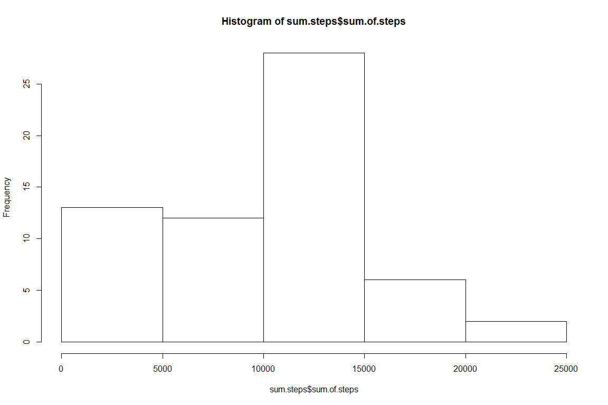
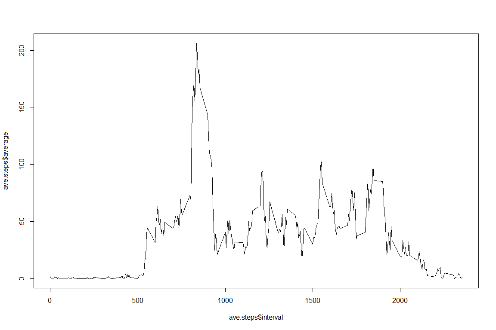
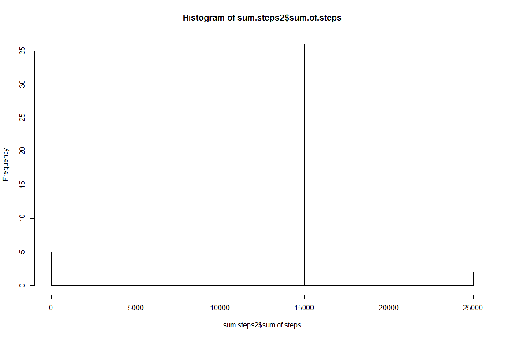
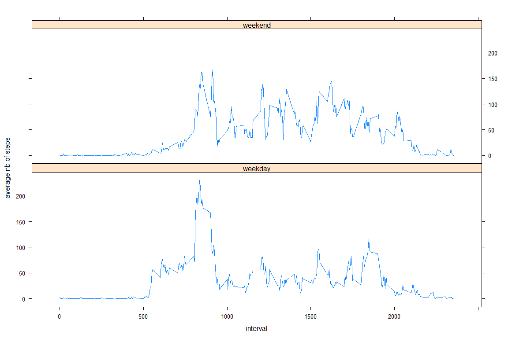

# Reproducible Research: Peer Assessment 1


## packages and global options


```r
knitr::opts_chunk$set(fig.width=12, fig.height=8, echo=TRUE, warning=FALSE, message=FALSE)
library(dplyr)
library(lattice)
```


## Loading and preprocessing the data


```r
activity <- read.csv(unz("activity.zip","activity.csv"))
activity$date <- as.Date(activity$date)
```

## What is mean total number of steps taken per day?

```r
sum.steps <- activity %>%
  group_by(date) %>%
  summarise(sum.of.steps = sum(steps, na.rm=T))
```


```r
hist(sum.steps$sum.of.steps)
```

<!-- -->


```r
mean <- mean(sum.steps$sum.of.steps)
median <- median(sum.steps$sum.of.steps)
```

The mean and median of the total number of steps taken per day are respectively:
9354.2295082 and 10395

## What is the average daily activity pattern?

```r
ave.steps <- activity %>%
   group_by(interval) %>%
   summarise(average = mean(steps, na.rm=T))
plot(ave.steps$interval, ave.steps$average, type="l")
```

<!-- -->


```r
interval.max.steps <- ave.steps$interval[which.max(ave.steps$average)]
```

On average, across all the days in the dataset, 835 is the 5-minute interval containing the maximum number of steps.

## Imputing missing values

```r
nb.na <- sum(is.na(activity$steps))
```

There are 2304 missing values  

Next step: filling in all of the missing values in the dataset.  
NA are estimated as the mean of the non-missing 5-minute interval data.
Put the results in table activity2


```r
activity2 <- merge(activity,ave.steps)
activity2$steps[is.na(activity2$steps)] <- activity2$average[is.na(activity2$steps)]
activity2$average <- NULL
```


```r
sum.steps2 <- activity2 %>%
  group_by(date) %>%
  summarise(sum.of.steps = sum(steps, na.rm=T))
```


```r
hist(sum.steps2$sum.of.steps)
```

<!-- -->


```r
mean2 <- mean(sum.steps2$sum.of.steps)
median2 <- median(sum.steps2$sum.of.steps)
```

The mean and median of the total number of steps taken per day are respectively:
1.0766189\times 10^{4} and 1.0766189\times 10^{4}  
As a reminder, without estimating NAs, mean and median are respectively:
9354.2295082 and 10395

Imputing missing data lead to an increase of the mean of total daily number of steps   by 15.0943396%


## Are there differences in activity patterns between weekdays and weekends?


```r
activity2$weektime <- factor("weekday", levels=c("weekday","weekend"))
activity2$weektime[weekdays(activity2$date) %in% c('samedi', 'dimanche')] <- "weekend"
```


```r
wd_we <- activity2 %>%
   group_by(interval,weektime) %>%
   summarise(average = mean(steps, na.rm=T))
xyplot(average ~ interval | weektime, type = "l", ylab="average nb of steps", data=wd_we, layout = c(1, 2))
```

<!-- -->
